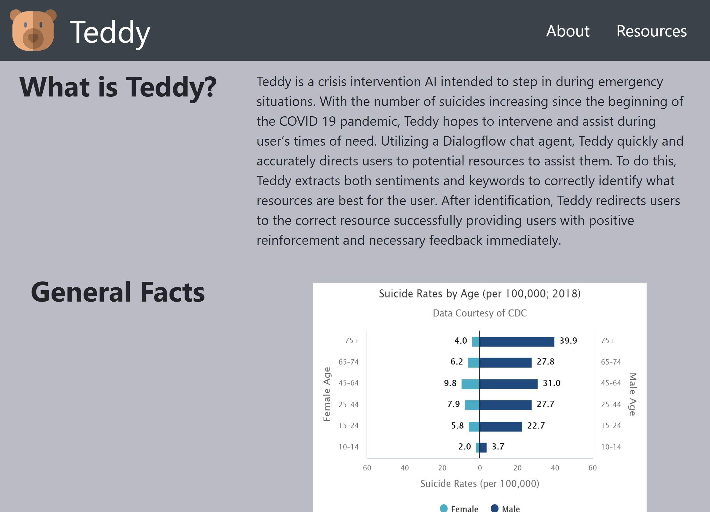

# CornHacks2021- Teddy 

##### Created by Tommy Braccia, Danny Tran, and Emma Hubka

## Inspiration

The problem we identified for our project was the high number of suicides in the U.S. In 2019 alone, about 47,511 people died of suicide--which is 14.5 deaths per 100,000 population. Suicide was also ranked the 10th leading cause of death in 2019. To mitigate this problem, we wanted to create an application that would intervene in times of crisis. We decided to name this application Teddy. Teddy is a crisis intervention AI intended to step in during emergency situations. Our goal for Teddy is to intervene, assist, and provide comfort during user’s times of need. 

## What it does

Teddy works by utilizing a Dialogflow chat agent. This allows Teddy to get the information needed to quickly and accurately direct users to helpful resources. Teddy extracts both sentiments and keywords to correctly identify what resources are the best fit for the person. After identification, Teddy successfully redirects individuals to the correct resources by providing them with positive reinforcement and necessary feedback immediately.

## Challenges that we faced
* Learning how to communicate effectively and efficiently online. 
* Building a custom chat form when most examples of them are proprietary given the current market.
* Spinning up an entire website for a hackathon is a challenge as it is typically more tedious than spinning up an application.
* Only having 24 hours to complete our project when many other hackathons have 36.

## Accomplishments that we are proud of
* The fact that Teddy is cross-platform is something I am very proud of. 
* Created a custom chat form that simply interacts very efficiently with a Dialogflow Endpoint.
* Our ability to adapt to working as a team in a remote environment.
* Our ability to condense seventy-two hours’ worth of work into five minutes for our video.
* After extensive research, we were able to create over a thousand different responses available to the individual 

## What we learned
* We learned how to work together on a project remotely.
* We learned a lot about how suicide affects many individuals and the vast amount of resources that are available to help them.
* We learned how to connect Dialogflow to our React website

## What's next for Teddy?

Now that Teddy is operational, we hope to increase the number of categorical groups so that we can provide more accurate and helpful resources. Once enough data is collected, we would love to extend Teddy to international usage since suicide is also prevalent outside the United States. 

## Technologies and Tools Used:

- [Dialogflow](https://cloud.google.com/dialogflow) for the Chat Agent
- [React](https://reactjs.org/) website with [Bootstrap](https://react-bootstrap.github.io/)
- [NPM Keyword Extractor](https://www.npmjs.com/package/keyword-extractor)
- [NPM Sentiment](https://www.npmjs.com/package/sentiment)
- [Flaticon](https://www.flaticon.com/free-icon/teddy-bear_771988?term=teddy%20bear&page=3&position=79&page=3&position=79&related_id=771988&origin=search)

## Screenshots

### Dialog Flow (1)

### Dialog Flow (2)

### About Page

### Resources Page

## Google Assistant
### Mobile View

### Web View

## Development

To test the offline version of the agent's fufillment run `node .` inside of AgentFufillmentDev.
